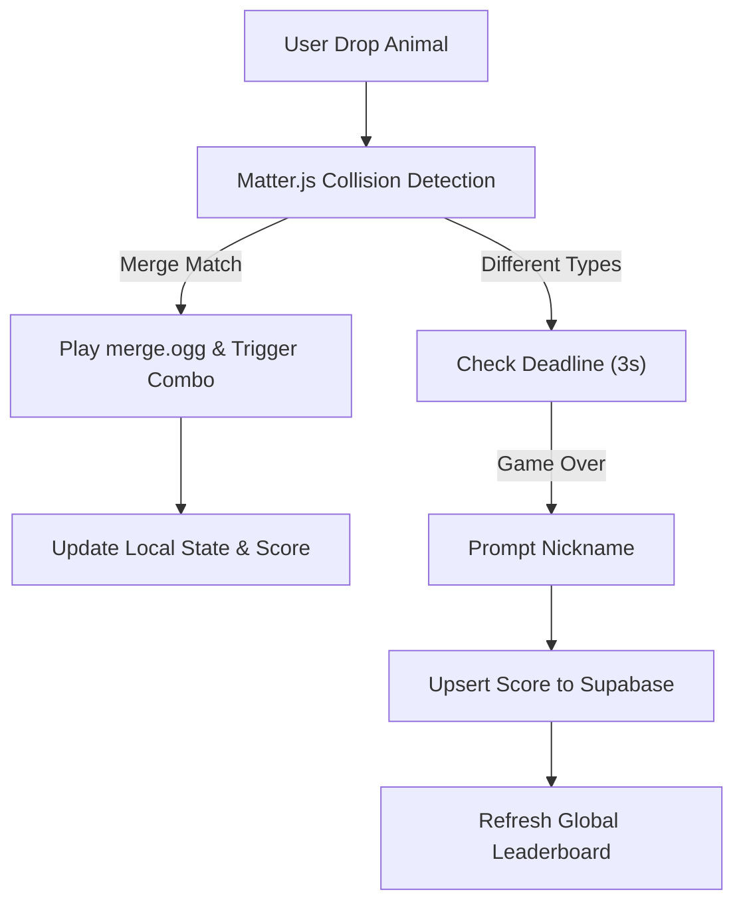

# Animal Merge Game Design

## Route And Naming

* Utility name: Animal Merge
* Slug: `animal-merge`
* Route: `/animal-merge`
* App files:
* `app/animal-merge/page.tsx`
* `app/animal-merge/merge-client.tsx`
* `app/api/merge/rank/route.ts` (Supabase Proxy)


* Planning files:
* `mockups/utilities/animal-merge/requirements.md`
* `mockups/utilities/animal-merge/design.md`
* `mockups/utilities/animal-merge/todo.md`


## Information Architecture

The page integrates with the existing DOPT utility shape while maintaining high game-play immersion:

* `SiteHeader`
* Intro panel with title, high score display, and "Start Game" button.
* Main workbench
* **Game Canvas**: Matter.js based physics world.
* **Evolution Guide**: Circular roadmap of animal levels.
* **Leaderboard**: Global Top 10 ranks fetched from Supabase.


* Recent history panel (Local bests and unlocked dictionary).



## UI Structure

* `MergeClient`
* Root container for Matter.js engine and Supabase real-time subscriptions.
* Manages `isGameOver`, `score`, and `comboCount`.


* Board section
* SVG/Canvas hybrid: SVG for guide lines, Canvas for physics bodies.
* Next Preview overlay (Top-right).
* Floating Combo UI (Dynamic positioning).


* Sidebar section
* **Global Leaderboard**: Fetching `nicknames` and `scores`.
* **Evolution Guide**: Clockwise arrow roadmap using `public/game_assets/animal_merge/images/`.


* Action Control
* "Shake" button (Cooldown managed in state).
* "Restart" with score reset.


## Interaction Flow

1. User clicks Start: Audio context unlocks, `merge.ogg` preloads.
2. User moves cursor: 대기 중인 동물이 X축을 따라 이동하며, 눈동자 이미지가 커서를 추적(Look-at logic).
3. User clicks: 원형 물리 바디 생성 및 자유 낙하.
4. Merge Event: 동일 라벨 충돌 시 이펙트 생성, 사운드 재생, 콤보 카운트 업.
5. Game Over: 최상단 센서에 물리 바디가 3초간 머무를 시 발생.
6. Record Submission: 점수 검증 후 Supabase `scores` 테이블로 `insert`.
7. Ranking Update: 새로운 랭킹 리스트를 즉시 Fetch하여 반영.

## State Model

```ts
type AnimalLevel = 1 | 2 | 3 | 4 | 5 | 6 | 7 | 8 | 9 | 10;

type GameRecord = {
  id: string; // UUID
  nickname: string;
  score: number;
  max_level: AnimalLevel;
  created_at: string;
};

type MergeState = {
  score: number;
  combo: number;
  lastMergeTime: number;
  unlockedAnimals: AnimalLevel[];
  history: GameRecord[]; // Top 10 from Supabase
};

```

## Physics & Animation Design

* **Engine**: Matter.js (Circle bodies).
* **Physical Traits**:
* `snake`: Low friction (Slippery).
* `sloth`: High friction (Sticky).
* `rhino/whale`: High density (Heavy impact).


* **Juice**:
* Merge: 0.1s scale-up animation on new body creation.
* Combo: Floating text with CSS `translateY` and `opacity` fade.
* Eye Tracking: `Math.atan2` 기반 눈동자 오프셋 계산.


## Supabase Integration

* **Table**: `animal_merge_ranks`
* `id` (uuid, primary key)
* `nickname` (text, non-nullable)
* `score` (int8, non-nullable)
* `max_level` (int2)
* `created_at` (timestamptz)


* **Security**:
* Row Level Security (RLS) enabled.
* 클라이언트 직접 통신 대신 `app/api/merge/rank/route.ts`를 Proxy로 사용하여 간단한 점수 검증(Check-sum) 수행 후 서비스 롤 권한으로 DB 쓰기 수행.


## Validation And Errors

* Nickname: 2~10자 제한, 비속어 필터링.
* Anti-Cheat: 이전 병합 로그를 기반으로 한 점수 무결성 검사 (서버 사이드).
* Network: Supabase 연결 실패 시 `localStorage`에 임시 저장 후 재연결 시 동기화 시도.

## Implementation Notes

* Images: `public/game_assets/animal_merge/images/*.png`
* Audios: `public/game_assets/animal_merge/audios/merge.ogg`
* Use `requestAnimationFrame` for custom Canvas rendering (Eyes, Particles).
* Use `next/dynamic` for `MergeClient` to avoid SSR issues with Canvas/Matter.js.
* Ensure `SiteHeader` remains sticky while the game canvas fills the viewport height.
## Asset Preload UX/Flow (Added)

### Interaction Flow Update

1. Page mounts -> begin preloading all mandatory image/audio assets.
2. UI shows preload card (progress bar + loaded/total counter + status text).
3. Once progress reaches 100%, show "Assets ready" and enable Start Game.
4. On preload failure, show warning and expose Retry action.

### State Model Addition

```ts
type AssetPreloadState = {
  status: "idle" | "loading" | "ready" | "error";
  loadedCount: number;
  totalCount: number;
  failedAssets: string[];
};
```

### Implementation Notes Update

- Use `Promise.allSettled` for preload robustness.
- Keep a memoized image map for rendering to avoid creating `new Image()` every frame.
- Keep a pre-created `HTMLAudioElement` instance for merge SFX playback.
- Render a glassmorphism-styled progress bar while `status !== "ready"`.
