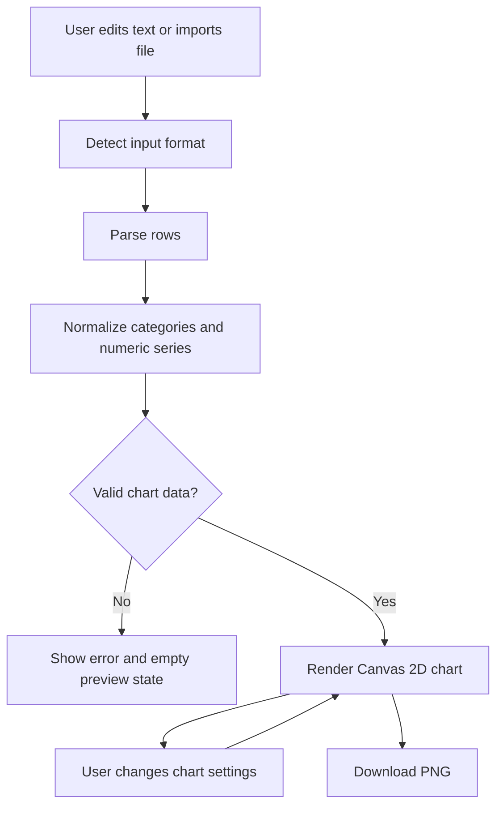

# Design: Chart Studio

## Route And Naming

- Utility name: Chart Studio
- Slug: `chart-studio`
- Route: `/chart-studio`
- Planning files: `mockups/utilities/chart-studio/`
- App files:
  - `app/chart-studio/page.tsx`
  - `app/chart-studio/chart-studio-client.tsx`
  - `public/images/utilities/chart-studio-preview.svg`

## Information Architecture

- Shared `SiteHeader`.
- Intro panel with title, status tags, and concise utility positioning.
- Main studio workbench:
  - Left side: data editor, import controls, sample buttons, parse summary.
  - Right side: canvas preview and export actions.
- Settings panel below or beside the editor depending on viewport:
  - Chart type
  - Palette
  - Titles and labels
  - Numeric style controls
  - Rendering toggles

## UI Structure

- `ChartStudioPage`
  - Server component.
  - Owns metadata and JSON-LD.
  - Renders page shell, `SiteHeader`, and `ChartStudioClient`.
- `ChartStudioClient`
  - Owns data text, file import, chart settings, parse result, canvas rendering, and PNG export.
- Helper functions in the client file:
  - `parseDelimited`
  - `parseJsonData`
  - `parseChartData`
  - `normalizeNumber`
  - `drawChart`
  - `drawBarChart`
  - `drawLineChart`
  - `downloadCanvasPng`

## Interaction Flow



## State Model

- `source`: current editor text.
- `sourceKind`: `auto`, `csv`, `tsv`, or `json`.
- `chartType`: `bar3d` or `line3d`.
- `title`, `xLabel`, `yLabel`: editable chart copy.
- `paletteId`: active palette.
- `depth`: 3D extrusion/depth amount.
- `perspective`: fixed-view slant amount.
- `showLegend`: boolean.
- `showValueLabels`: boolean.
- `showGrid`: boolean.
- `smoothLines`: boolean.
- `showPoints`: boolean.
- `glow`: number.
- `fileStatus`: transient import status.
- `downloadState`: transient export status.
- `isDragging`: drag/drop state.

## Data Model

```ts
type ChartDataset = {
  categories: string[];
  series: Array<{
    name: string;
    values: Array<number | null>;
  }>;
  warnings: string[];
};
```

- Categories come from the first column or category-like JSON key.
- Each series has the same length as categories.
- `null` values are gaps for line charts.
- Bar charts treat `null` as zero and surface a warning.

## Rendering Model

- Canvas is resized to its CSS box with device-pixel-ratio scaling.
- A dark presentation surface is painted first.
- World coordinates are projected into screen coordinates with a fixed 3D offset:
  - Depth affects lane offset and bar side/top faces.
  - Perspective affects vertical slant.
- Bar chart:
  - Compute grouped bar widths from category and series counts.
  - Draw back bars first, front bars last.
  - Each bar uses front, side, and top faces.
- Line chart:
  - Each series uses a depth lane.
  - Draw shadow/glow trail first.
  - Draw line path and point markers on top.
  - Smooth mode uses quadratic curves between points.
- Legend and labels render in screen space after the chart geometry.

## Validation And Errors

- Empty source: show a friendly empty error.
- Unsupported JSON shape: show a JSON-specific error.
- No numeric series: show a validation error.
- Ragged rows: pad missing cells and warn.
- Non-numeric values: convert to `null` and warn.
- File over 2 MB: reject before reading.
- Unsupported extension in auto mode: still attempt text parsing and warn.

## Implementation Notes

- Use existing shared classes such as `panel`, `button`, `ghost-button`, `textarea`, `field`, `label`, `tag`, `notice`, and `segmented-control`.
- Add chart-specific CSS to `app/globals.css` with a `chart-studio-` prefix.
- Avoid changing unrelated global styles.
- Keep all new text copy in the new route and preview asset.
- Add seed data for home visibility in `lib/seed.ts`.
- Add `utilitySeoDescriptions` entry for `/chart-studio` in `app/page.tsx`.
- Add static sitemap path only if needed. The current sitemap already includes public visualization URLs dynamically, so seed visibility is enough for non-Supabase local mode.

## SEO

- Page title: `Chart Studio`
- Canonical route: `/chart-studio`
- Open Graph/Twitter image: `/images/utilities/chart-studio-preview.svg`
- Structured data:
  - `WebSite`
  - `SoftwareApplication`
  - Free offer metadata
  - Feature list covering manual input, CSV/TSV/JSON import, 3D bar, 3D line, and PNG export.
