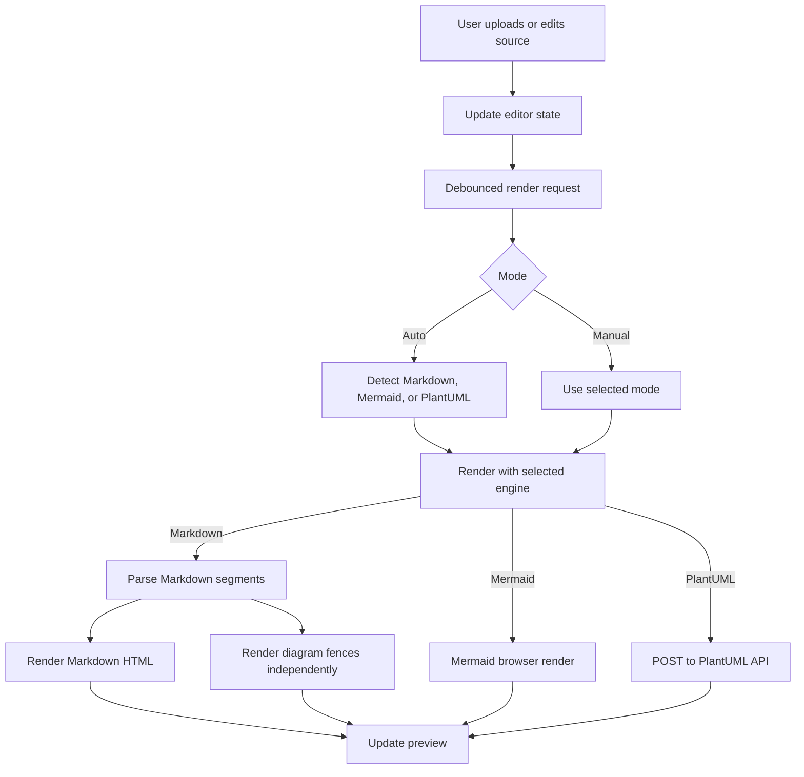

# Design: Diagram Previewer

## Route And Naming
- Utility name: Diagram Previewer
- Slug: `diagram`
- Route: `/diagram`
- Planning workspace: `mockups/utilities/diagram/`
- App files:
  - `app/diagram/page.tsx`
  - `app/diagram/diagram-client.tsx`
  - `app/api/plantuml/render/route.ts`

## Information Architecture
- Header: reuse `SiteHeader`.
- Intro panel: name, short purpose, detected engine/status tags.
- Main work area:
  - Source panel with upload, mode selector, samples, and editor.
  - Preview panel below it with toolbar, render status, and scrollable preview surface.
- Notes panel: concise privacy note for PlantUML server rendering.

## UI Structure
- `DiagramPage`
  - Server component that renders the page shell and `DiagramClient`.
- `DiagramClient`
  - Owns editor state, file handling, mode selection, persistence, render orchestration, and toolbar actions.
- `MarkdownPreview`
  - Produced inside `DiagramClient` from parsed document segments.
- `DiagramBlock`
  - Internal rendered block state for Mermaid or PlantUML code fences.
- API route:
  - Receives `{ source, format }`.
  - Validates size and format.
  - Encodes PlantUML with raw deflate and PlantUML's URL-safe alphabet.
  - Fetches `${PLANTUML_SERVER_URL}/svg/<encoded>`.
  - Returns `{ svg }` or `{ error }`.

## Interaction Flow

## State Model
- `source`: current editor text.
- `selectedMode`: user-selected mode, one of `auto`, `markdown`, `mermaid`, `plantuml`.
- `fileName`: latest uploaded file name or sample name.
- `fileError`: upload validation errors.
- `renderState`:
  - `status`: `idle`, `loading`, `ready`, or `error`.
  - `engine`: resolved render engine.
  - `html`: sanitized Markdown HTML when applicable.
  - `svg`: SVG for direct Mermaid/PlantUML rendering.
  - `blocks`: rendered diagram blocks for Markdown mode.
  - `error`: top-level render error message.
- `zoom`: preview zoom percentage.
- `pngState`: transient PNG export state for the async browser rasterization step.

## Validation And Errors
- File extension validation happens before reading.
- Source larger than 1 MB blocks rendering and shows an error.
- Mermaid render errors are caught and displayed with the resolved engine.
- PlantUML API errors are returned as JSON and displayed in preview.
- Markdown parsing escapes raw HTML and sanitizes generated links.
- Stale async render results are ignored by a monotonically increasing render id.
- SVG export uses the direct diagram SVG for single Mermaid/PlantUML mode.
- SVG export builds a pure SVG document from Markdown text, code blocks, and rendered diagram blocks for Markdown mode.
- PNG export derives dimensions from the export SVG, then rasterizes in a canvas.

## Implementation Notes
- Install runtime dependencies:
  - `mermaid` for browser diagram rendering.
  - Keep Markdown rendering local with a lightweight parser to reduce dependency surface.
- Use dynamic `import("mermaid")` inside the client component so the package never runs during SSR.
- Initialize Mermaid with `startOnLoad: false`, `securityLevel: "strict"`, and a default light theme.
- Render preview content on a white document-like surface with dark text.
- Use `dangerouslySetInnerHTML` only with generated/sanitized SVG or sanitized Markdown HTML.
- For Markdown, tokenize fenced code blocks first, render plain Markdown segments, then interleave diagram previews.
- PlantUML server URL should read `PLANTUML_SERVER_URL`, defaulting to `https://www.plantuml.com/plantuml`.
- SVG and PNG download should use the full current preview; in Markdown mode this includes Markdown content and every rendered diagram block without relying on SVG `foreignObject`.
- Add `PLANTUML_SERVER_URL` to `.env.example`.
- Add a seed visualization entry so `/diagram` appears on the home page when Supabase is not configured.
