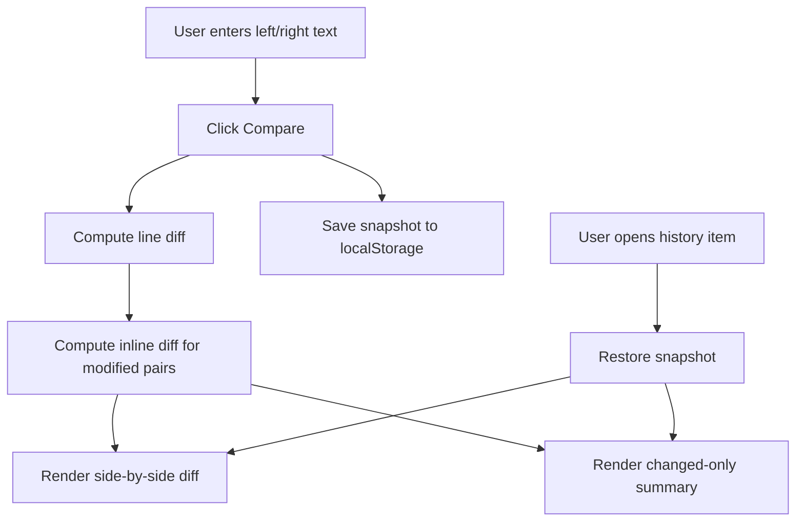

# Design: Text Diff Utility

## Route And Naming
- Utility name: Text Diff Utility
- Slug: `diff`
- Route file: `app/diff/page.tsx`
- Runtime: client component (`"use client"`) to support localStorage and interactive diff.

## Information Architecture
- Section 1: Header (title + short instructions)
- Section 2: Input panel (left/right textareas + actions + options)
- Section 3: Diff result panel (side-by-side line diff)
- Section 4: Summary panel (change-only cards)
- Section 5: History panel (restore/delete/clear)

## UI Structure
- Two-column input layout on desktop, stacked on mobile.
- Side-by-side diff rows:
- Left line number + content
- Right line number + content
- Row badge: Added / Removed / Modified
- Summary cards:
- Show type, line references, and short before/after snippets.
- History list:
- Timestamp + first-line preview + diff counts.

## Interaction Flow

## State Model
- `leftInput: string`
- `rightInput: string`
- `leftCompared: string`
- `rightCompared: string`
- `history: HistoryEntry[]`
- `options: { ignoreCase: boolean; trimTrailingWhitespace: boolean }`

### Derived State
- `diffRows: DiffRow[]`
- `summaryItems: SummaryItem[]`
- `counts: { added: number; removed: number; modified: number }`

## Diff Algorithm
- Preprocess lines by selected options for comparison key only.
- Run LCS-based line diff to classify unchanged/added/removed.
- Pair nearby removed+added rows as modified when both exist in same change block.
- For modified rows, run character-level LCS to generate inline highlight segments.

## Validation And Errors
- If both compared texts are empty, show empty guidance.
- Guard localStorage parsing with try/catch and fallback to empty history.
- Cap history to 40 items to prevent uncontrolled growth.

## Implementation Notes
- Keep implementation self-contained in `app/diff/page.tsx` for initial delivery.
- Reuse existing global classes (`page-shell`, `panel`, `muted`, `button`, etc.).
- Add focused utility classes in `app/globals.css` for:
- diff grid
- line row highlights
- inline token highlights
- history list cards
