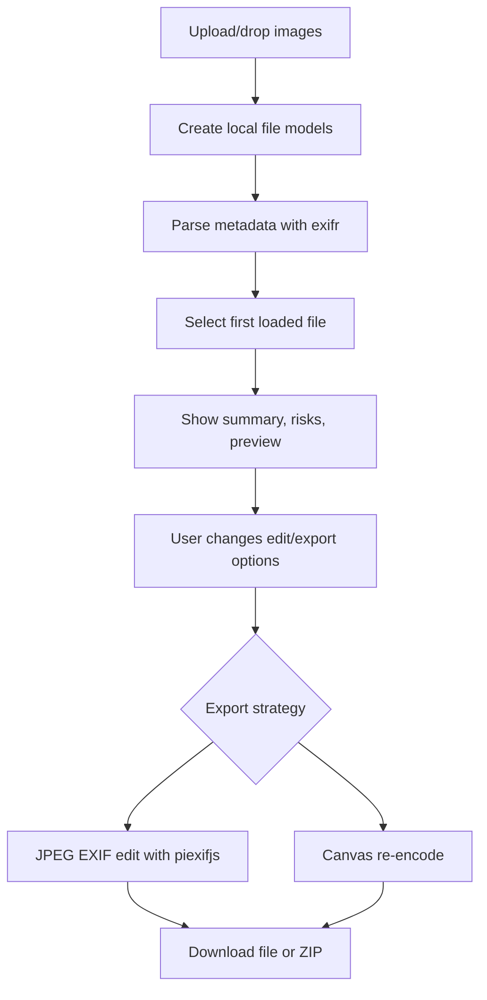

# EXIF Toolkit Design

## Route And Naming

- Utility name: EXIF Toolkit.
- Slug: `exif`.
- Route: `/exif`.
- App files:
  - `app/exif/page.tsx` for metadata, structured data, shell, and route export.
  - `app/exif/exif-client.tsx` for browser-only metadata parsing and export behavior.
- Planning files live under `mockups/utilities/exif/`.

## Information Architecture

The page follows the existing utility layout pattern:

- Intro panel with route label, short description, selected file count, and local-only privacy status.
- Main workbench with:
  - Left column: upload, file list, preview, export controls.
  - Right column: metadata summary, GPS/date tools, raw table.
- Secondary actions live near the relevant panel, not in a global toolbar.



## UI Structure

- `ExifClient`
  - Owns all file, parsing, selection, edit, and export state.
  - Provides drag/drop and file picker entry points.
- `FileQueue`
  - Shows filename, dimensions, parse status, risk count, and selected state.
- `PreviewPanel`
  - Displays image preview, selected file facts, and status.
- `SummaryPanel`
  - Shows metadata facts and privacy risk chips.
- `GpsPanel`
  - Shows coordinates, map links, remove GPS control.
- `DatePanel`
  - Shows detected date and edit controls.
- `ExportPanel`
  - Controls strategy, format, quality, filename suffix, and batch ZIP export.
- `RawMetadataTable`
  - Searchable table for flattened metadata.

All sections use existing global classes first (`panel`, `stack`, `utility-workbench`, `button`, `ghost-button`, `danger-button`, `tag`, `notice`, `table`) and small `exif-*` additions in `app/globals.css`.

## Interaction Flow

1. User picks or drops image files.
2. Client creates object URLs and parses metadata.
3. Parsed files appear in the queue. The first valid file is selected.
4. Selected file panels update from state.
5. User can:
   - Toggle GPS/risky field removal for JPEG EXIF edit export.
   - Shift capture dates or set an exact date.
   - Fill text metadata fields for supported JPEG exports.
   - Choose canvas re-encode to strip all metadata and optionally change format.
6. User exports selected image or all valid images as ZIP.
7. Export status reports success or clear failure.

## State Model

```ts
type LoadedImage = {
  id: string;
  file: File;
  url: string;
  status: "loading" | "ready" | "error";
  error: string;
  metadata: Record<string, unknown>;
  flattened: MetadataRow[];
  facts: ImageFacts;
  risks: RiskFlag[];
};

type ExportSettings = {
  strategy: "jpeg-edit" | "canvas";
  format: "image/jpeg" | "image/png" | "image/webp";
  quality: number;
  suffix: string;
  removeGps: boolean;
  removeRisky: boolean;
  normalizeOrientation: boolean;
  dateMode: "keep" | "shift" | "set";
  shiftHours: number;
  shiftMinutes: number;
  setDateTime: string;
  artist: string;
  copyright: string;
  description: string;
  software: string;
};
```

Derived values:

- Selected file from `selectedId`.
- GPS coordinates from EXIF latitude/longitude variants.
- Capture date from common EXIF fields.
- Export availability from file type and strategy.

## Validation And Errors

- Reject non-image files before parsing.
- Show parse errors per file without blocking other files.
- Disable JPEG EXIF edit controls for non-JPEG files.
- Disable export when no ready file is selected.
- Clamp quality between 0.1 and 1.
- Validate exact date input before export.
- Catch library/canvas/download failures and show a notice.

## Implementation Notes

- Use `exifr` to parse EXIF, GPS, XMP, ICC, IPTC, and file metadata where available.
- Use `piexifjs` only in the client for JPEG EXIF load/edit/dump/insert/remove.
- Use `jszip` for batch ZIP creation.
- Use object URLs for previews and revoke stale URLs.
- Canvas export draws through `createImageBitmap` when available and falls back to `HTMLImageElement`.
- Canvas re-encode strips metadata by design.
- JPEG EXIF edit export should:
  - Load the original JPEG data URL.
  - Start from current EXIF when available, or an empty EXIF structure.
  - Remove GPS when requested.
  - Remove selected risky identity tags when requested.
  - Apply date edits to IFD0/Exif date fields.
  - Apply text fields when provided.
  - Insert dumped EXIF back into the JPEG data URL.
- ZIP files should use unique names when duplicate source names exist.
