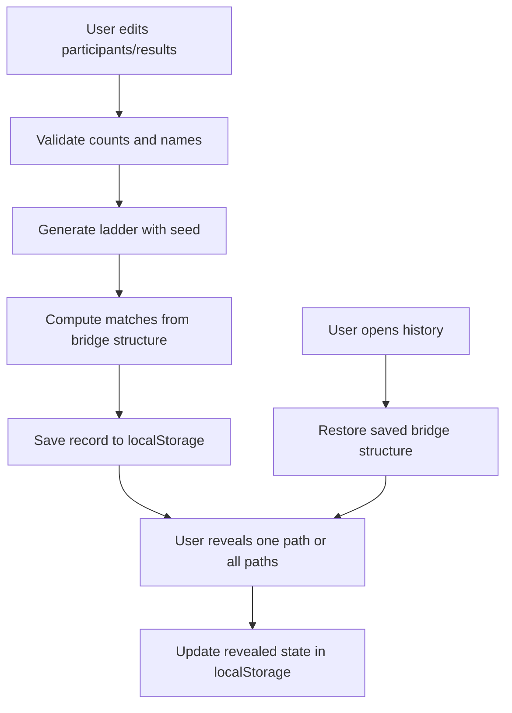

# Ladder Game Design

## Route And Naming

- Utility name: Ladder Game
- Slug: `ladder`
- Route: `/ladder`
- App files:
  - `app/ladder/page.tsx`
  - `app/ladder/ladder-client.tsx`
- Planning files:
  - `mockups/utilities/ladder/requirements.md`
  - `mockups/utilities/ladder/design.md`
  - `mockups/utilities/ladder/todo.md`

## Information Architecture

The page uses the existing DOPT utility shape:

- `SiteHeader`
- Intro panel with title, description, and complexity control
- Main workbench
  - Input editor
  - Ladder board
  - Result summary
- Recent history panel



## UI Structure

- `LadderClient`
  - Owns all client state and localStorage effects.
  - Renders editor, board, summary, and history.
- Editor section
  - Participant and result columns.
  - Add/remove/reorder buttons.
  - Complexity segmented control.
  - Generate, shuffle, reset actions.
- Board section
  - Top participant buttons.
  - SVG ladder drawing.
  - Bottom result cards.
  - Uses fixed geometry based on participant count and row count.
- Summary section
  - Match rows with hidden/revealed state.
  - Reveal all action.
- History section
  - Recent records list.
  - Restore, use as new, delete, clear actions.

## Interaction Flow

1. User edits names/results.
2. User selects complexity.
3. User clicks generate.
4. Client trims inputs and validates:
   - count 2..12
   - participant count equals result count
5. Client creates seed and bridge structure.
6. Client computes match indexes.
7. Client saves record to `localStorage`.
8. User clicks participant.
9. Client computes route points and animates route.
10. On animation completion, participant index is added to `revealedIndexes`.
11. Updated record is persisted.
12. User can restore a saved record later and replay any path.

## State Model

```ts
type Complexity = "simple" | "balanced" | "dense";

type Bridge = {
  row: number;
  left: number;
};

type LadderRun = {
  id: string;
  createdAt: string;
  participants: string[];
  results: string[];
  complexity: Complexity;
  seed: number;
  rowCount: number;
  bridges: Bridge[];
  matches: number[];
  revealedIndexes: number[];
};
```

Derived state:

- `activePath`: route points for currently selected participant.
- `selectedIndex`: participant being traced.
- `isTracing`: route animation state.
- `history`: parsed valid saved records.
- `validationMessage`: current input validation error.

## Ladder Algorithm

- Use a small deterministic pseudo-random generator from seed.
- Pick row count by complexity and participant count:
  - simple: `participants * 2 + 4`
  - balanced: `participants * 3 + 6`
  - dense: `participants * 4 + 8`
- For each row, test adjacent columns.
- Add bridge when random threshold passes.
- Skip a bridge if the same row already has a bridge at `left - 1`, `left`, or `left + 1`.
- Compute a match by walking from top to bottom:
  - At each row, move right if a bridge starts at current column.
  - Move left if a bridge starts at current column - 1.
  - Otherwise continue downward.

## Animation Design

- Board lines are SVG paths.
- Generated ladders use CSS animation on stroke dash offset.
- Active route is a highlighted SVG polyline.
- Active route also uses dash offset to simulate travel.
- Result cards use opacity/transform transitions when revealed.
- Reveal all applies staggered transition delay per result.
- Reduced motion disables dash animations and shortens transitions.

## Validation And Errors

- Show a notice in the editor when validation fails.
- Disable generate when obvious constraints fail.
- Keep exact error text near the controls.
- Storage errors are captured and shown as non-blocking notices.
- Invalid history payloads are filtered out during parsing.

## Implementation Notes

- Keep all logic in `app/ladder/ladder-client.tsx` unless shared usage emerges.
- Keep server page in `app/ladder/page.tsx` for metadata and JSON-LD.
- Add CSS classes in `app/globals.css` under a ladder section.
- Add preview asset at `public/images/utilities/ladder-preview.svg`.
- Add seed visualization entry in `lib/seed.ts`.
- Add static sitemap path `/ladder` in `app/sitemap.ts` so it is always present.
- Do not add Supabase tables for this utility; browser history is the requested persistence layer.
