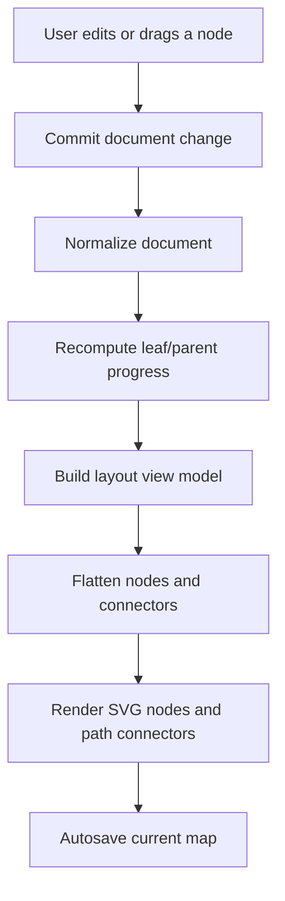

# Design: Mind Map Studio

## Route And Naming

- Utility name: Mind Map Studio
- Slug: `mindmap`
- Route: `/mindmap`
- Planning files: `mockups/utilities/mindmap/`
- App files:
  - `app/mindmap/page.tsx`
  - `app/mindmap/mindmap-client.tsx`
  - `public/images/utilities/mindmap-preview.svg`

## Information Architecture

- Header: shared `SiteHeader`.
- Intro and toolbar:
  - Layout selector.
  - Density selector.
  - Canvas focus toggle.
  - Search, undo/redo, zoom, fit, and reset controls.
- Canvas panel:
  - Full SVG mind map scene.
  - Quick menu for selected nodes.
  - Inline title editor.
  - Hover detail overlay.
  - Exchange and Browser Library panels below the canvas when not in focus mode.
- Side stack:
  - Node editor.
  - Templates.
  - Outline.
  - Stats.

## UI Structure

- `MindMapPage`
  - Server component for page metadata, JSON-LD, page shell, and `MindMapClient`.
- `MindMapClient`
  - Owns history, selection, pan/zoom, editing, import/export, storage, and pointer interactions.
- View model helpers:
  - Build tree layout from persisted node data.
  - Flatten positioned nodes and connectors for SVG rendering.
  - Generate connector paths with SVG cubic Bezier commands.
- Serialization helpers:
  - JSON, Markdown, OPML, FreeMind, Mermaid, CSV.
  - SVG and PNG visual export.

## Interaction Flow



## Canvas Model

- Persisted node data stores semantic information:
  - `id`, `title`, `note`, `tags`, `priority`, `progress`, `color`, `collapsed`, `offsetX`, `offsetY`, `children`.
- Layout view nodes are derived:
  - `x`, `y`, `width`, `height`, `side`, `depth`, and source node reference.
- Connector data is derived:
  - `from`, `to`, and SVG `path` string.
- Connectors are not persisted. They are regenerated whenever layout, density, offsets, collapse state, or hierarchy changes.

## Connector Rendering

`makeConnectorPath(from, to)` creates an SVG path command:

```text
M startX startY C control1X control1Y, control2X control2Y, endX endY
```

- `M` moves to the edge of the parent node.
- `C` draws a cubic Bezier curve to the child node.
- Control points are offset horizontally according to the child side and distance.
- The browser SVG renderer draws the final smooth curve from the `d` attribute.

## State Model

- `history`: undo/redo stack with `past`, `present`, and `future`.
- `selectedId`: selected node id.
- `focusId`: optional focused subtree root.
- `query`: search query.
- `density`: `compact`, `comfortable`, or `spacious`.
- `pan` and `zoom`: canvas viewport state.
- `dragStateRef`: active pointer drag information for node moves or hierarchy drops.
- `inlineEditor`: canvas title edit state.
- `outlineEditor`: outline title edit state.
- `hoverCard`: hover overlay position and placement.
- `importFormat`, `importText`, `importStatus`, `isImportDragging`: exchange import state.
- `savedMaps`, `saveName`, `activeSavedId`, `saveStatus`: Browser Library state.
- `copyState`, `pngState`: transient export feedback.

## Import/Export Layout

- Exchange panel sits immediately below the canvas.
- Browser Library sits below Exchange.
- Import row contains format selector and drag/drop file zone.
- Text areas remain available for copy/paste workflows.
- SVG/PNG export actions stay near text export actions because they export the same current map.

## Error Handling

- Import parser errors are converted into readable status messages.
- File size over 2 MB is rejected before reading.
- PNG export failures reset the button state after a short delay.
- Browser storage quota errors surface in the save status.
- Invalid hierarchy drops are ignored.

## Styling Notes

- Keep the canvas as a large, functional work surface rather than a decorative card.
- Use visually distinct density modes:
  - Compact: tighter nodes and connectors.
  - Comfortable: balanced default.
  - Spacious: larger nodes and wider spacing.
- Keep the hover overlay small, readable, and non-overlapping.
- Use shared button, input, textarea, panel, notice, and tag styles first.
- Keep repeated item cards limited to saved map rows and outline rows.

## SEO

- Page title: `Mind Map Studio`.
- Canonical route: `/mindmap`.
- Open Graph/Twitter preview image: `/images/utilities/mindmap-preview.svg`.
- Structured data:
  - `WebSite`
  - `SoftwareApplication`
  - Free offer metadata
  - Feature list covering editing, local saving, import/export, drag/drop, and visual export.
