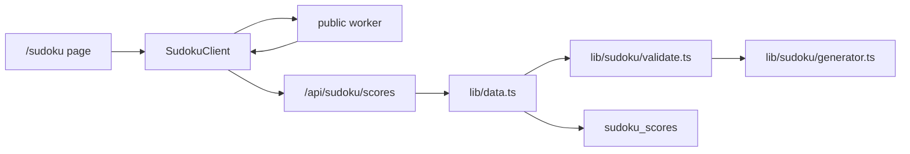
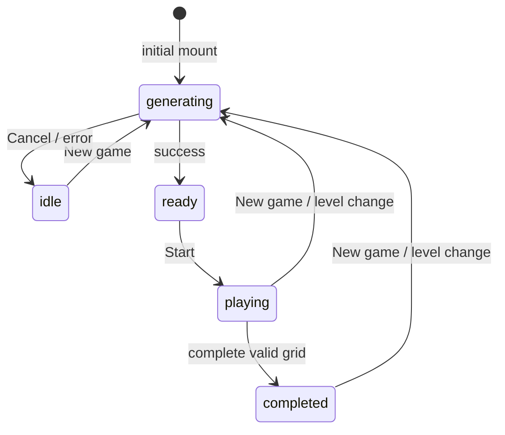

# 설계서: Sudoku

최종 업데이트: 2026-05-14

이 문서는 현재 구현된 스도쿠 게임의 구조와 동작을 설명한다. 요구사항은 `mockups/utilities/sudoku/requirements.md`를 기준으로 한다.

## 1. 아키텍처

| 영역 | 파일 |
| --- | --- |
| 페이지 | `app/sudoku/page.tsx` |
| 클라이언트 게임 | `app/sudoku/sudoku-client.tsx` |
| 스타일 | `app/globals.css`의 `.sudoku-*` 블록 |
| 점수 API | `app/api/sudoku/scores/route.ts` |
| 데이터 접근 | `lib/data.ts`의 `listSudokuScores`, `saveSudokuScore` |
| 생성 프로필 | `lib/sudoku/level-profiles.ts` |
| 서버 검증용 생성기 | `lib/sudoku/generator.ts` |
| 클라이언트 생성 Worker | `public/workers/sudoku-generator.worker.js` |
| 그리드 유틸 | `lib/sudoku/grid.ts` |
| 점수 계산 | `lib/sudoku/scoring.ts` |
| 제출 검증 | `lib/sudoku/validate.ts` |
| 타입 | `types/index.ts` |
| DB 스키마 | `supabase/sudoku_scores.sql` |

클라이언트 Worker와 서버 검증용 생성기는 같은 알고리즘 계열을 사용한다. 점수 제출 시 서버는 클라이언트가 보낸 퍼즐을 신뢰하지 않고 같은 시드와 레벨 프로필로 다시 생성해 비교한다.



## 2. 데이터 모델

### 2.1 그리드

```ts
export type Grid9 = number[][];
```

- 9x9 배열이다.
- 값 `0`은 빈칸이다.
- 값 `1-9`는 확정 숫자 또는 플레이어 입력 숫자다.
- `givenMask: boolean[][]`는 초기 퍼즐에서 고정 칸인지 표시한다.

### 2.2 상태

현재 클라이언트 상태는 다음 타입이다.

```ts
type ScreenPhase = "idle" | "generating" | "ready" | "playing" | "completed";
```

상태 전이는 다음과 같다.



현재 구현에는 `paused` 상태가 없다.

### 2.3 로컬 상태

`SudokuClient`는 다음 주요 상태를 가진다.

- `levelId`: 현재 레벨
- `phase`: 화면 상태
- `puzzle`: 생성된 퍼즐
- `playerGrid`: 플레이어 입력을 반영한 보드
- `givenMask`: 고정 칸 마스크
- `seed`: 퍼즐 재현용 시드
- `selected`: 현재 선택 칸
- `displayedMs`: 표시 시간
- `mistakeCount`: 실수 수
- `scores`: 글로벌 리더보드 목록
- `localBestMap`: 레벨별 로컬 베스트
- `flashConflictKey`: Lv 5 충돌 플래시용 셀 키

## 3. 퍼즐 생성 설계

### 3.1 입력

Worker 요청은 다음 형태다.

```ts
type WorkerGenerateMessage = {
  kind: "generate";
  id: number;
  seed?: number;
  profile: {
    maxRemovals: number;
    removalAttempts: number;
    fullRegenerateRounds: number;
  };
};
```

`id`는 생성 요청 순서를 구분한다. 오래된 Worker 응답은 현재 요청과 `id`가 다르면 무시한다.

### 3.2 알고리즘

생성 절차는 다음 순서다.

1. `mulberry32(seed)`로 결정적 난수를 만든다.
2. 백트래킹으로 완성된 9x9 보드를 채운다.
3. 무작위 고정 칸을 하나 제거한다.
4. `countSolutions`로 해답 수가 1개인지 확인한다.
5. 해답이 유일하면 제거를 확정하고, 유일하지 않으면 원복한다.
6. `maxRemovals`에 도달하거나 `removalAttempts`가 소진될 때까지 반복한다.
7. 결과가 부족하면 `fullRegenerateRounds` 범위 안에서 다른 난수 라운드로 재시도한다.

Worker는 진행률을 `progress` 메시지로 보내고, 성공 시 `success` 메시지로 `puzzle`, `seed`, `metadata`를 반환한다. 클라이언트는 반환된 퍼즐로 `givenMask`와 `playerGrid`를 만든다.

### 3.3 서버 검증 생성기

서버 검증에서는 `lib/sudoku/generator.ts`를 사용한다. 이 생성기는 제출된 `seed`와 `levelId`의 생성 프로필로 퍼즐과 정답을 다시 만든다.

검증 기준:

- 제출된 `puzzle` 문자열이 서버 재생성 퍼즐과 같아야 한다.
- 제출된 `givenMask`가 서버 재생성 퍼즐에서 계산한 마스크와 같아야 한다.
- 제출된 완성 보드가 서버 재생성 정답과 같아야 한다.

이 방식은 클라이언트가 임의의 퍼즐과 정답을 제출하는 위험을 줄인다.

## 4. 레벨과 도움 프로필

레벨은 생성 난이도와 플레이 중 도움 수준을 함께 결정한다.

| 레벨 | `maxRemovals` | 도움 요약 |
| --- | ---: | --- |
| 1 | 24 | 전체 도움 |
| 2 | 28 | 전체 도움 |
| 3 | 32 | 충돌 표시 |
| 4 | 36 | 선택 칸 충돌 |
| 5 | 40 | 즉시 경고 |
| 6 | 43 | 실수만 표시 |
| 7 | 46 | 실수만 표시 |
| 8 | 49 | 실수 약하게 표시 |
| 9 | 51 | 완료 후 공개 |
| 10 | 54 | 완료 후 공개 |

도움 프로필은 다음 속성을 가진다.

```ts
type SudokuAssistProfile = {
  conflictDisplay: "all" | "selected" | "flash" | "none";
  mistakeVisibility: "visible" | "subtle" | "completed";
  showPeerHighlight: boolean;
  showSameDigitHighlight: boolean;
  label: string;
};
```

`label`은 보드 내부가 아닌 `sudoku-play-header`의 `sudoku-board-status`에 표시한다. 이는 보드 숫자를 가리지 않기 위한 UI 결정이다.

## 5. Canvas 렌더링

### 5.1 레이아웃

Canvas는 보드와 숫자 패드를 함께 렌더링한다.

- 보드 크기: 컨테이너 폭과 최대 크기 안에서 계산
- 숫자 패드: 보드 아래 3x3 버튼과 지우기 버튼
- DPR: 최대 2.5까지 반영
- 리사이즈: `ResizeObserver`와 `window.resize`로 재계산

`measureLayout`은 보드 좌표, 셀 크기, 숫자 패드 좌표를 계산한다. `hitTest`는 포인터 좌표를 셀, 숫자, 지우기 버튼 중 하나로 변환한다.

### 5.2 그리기 순서

1. 배경 패널
2. 보드 그림자와 보드 배경
3. 고정 칸과 빈칸 톤
4. 선택 칸의 행/열/박스 강조
5. 같은 숫자 강조
6. 충돌 칸 강조
7. 선택 칸 테두리
8. 3x3 굵은 선과 일반 격자
9. 숫자
10. `ready` 상태 블러 오버레이
11. 숫자 패드와 지우기 버튼
12. `generating` 상태 오버레이

### 5.3 색상

Canvas는 컨테이너의 CSS 변수에서 색상을 읽는다.

- `--bg`
- `--panel`
- `--text`
- `--muted`
- `--border`
- `--border-strong`
- `--accent`
- `--danger`
- `--success`

## 6. 입력 처리

### 6.1 포인터

- 보드 셀을 누르면 `selected`를 변경한다.
- 숫자 패드를 누르면 선택 칸에 숫자를 입력한다.
- 지우기 버튼을 누르면 선택 칸을 `0`으로 바꾼다.
- `generating` 상태에서는 포인터 입력을 무시한다.
- 실제 숫자 입력은 `playing` 상태에서만 허용한다.

### 6.2 키보드

키보드 이벤트는 `window`에 등록한다. 입력 폼 내부에서는 단축키를 무시한다.

| 키 | 동작 |
| --- | --- |
| `ArrowLeft`, `A` | 왼쪽 이동 |
| `ArrowRight`, `D` | 오른쪽 이동 |
| `ArrowUp`, `W` | 위 이동 |
| `ArrowDown`, `S` | 아래 이동 |
| `1-9`, `Numpad1-9` | 숫자 입력 |
| `Backspace`, `Delete` | 지우기 |

선택 이동은 `ready`와 `playing`에서 가능하고, 숫자 입력과 지우기는 `playing`에서만 가능하다.

## 7. 실수와 완료 판정

숫자를 입력할 때마다 다음을 수행한다.

1. 고정 칸이면 무시한다.
2. `playerGrid`에 값을 반영한다.
3. 고정 칸 값을 다시 적용해 변조를 막는다.
4. `computeConflictCells`로 충돌을 계산한다.
5. 새 `row:col:value` 충돌이면 실수 수를 1 증가한다.
6. Lv 5에서는 해당 충돌 칸을 650ms 동안 플래시한다.
7. 보드가 완성되었고 충돌이 없으면 완료 처리한다.

완료 조건은 클라이언트에서는 "모든 칸 채움 + 충돌 없음"이다. 서버 제출 시에는 생성된 정답과 일치하는지도 추가 검증한다.

## 8. 점수 계산

점수 계산은 `lib/sudoku/scoring.ts`에 있다.

```ts
baseScore = 10000 + levelId * 1500 + emptyCells * 250;
timePenalty = elapsedSeconds * timePenaltyPerSecond(levelId);
mistakePenalty = mistakeCount * 300;
finalScore = Math.max(100, Math.round(baseScore - timePenalty - mistakePenalty));
```

초당 시간 패널티:

- Lv 1-3: 12
- Lv 4-7: 18
- Lv 8-10: 25

로컬 베스트는 `score`가 높은 기록을 우선한다. 점수가 같으면 `timeMs`가 짧은 기록을 선택한다.

## 9. API 설계

### 9.1 `GET /api/sudoku/scores?level=1`

응답:

```json
{
  "scores": [
    {
      "id": "uuid",
      "player_name": "DOPT",
      "level_id": 1,
      "time_ms": 81490,
      "score": 17236,
      "seed": 12345,
      "created_at": "2026-05-14T00:00:00.000Z"
    }
  ]
}
```

레벨 파라미터가 잘못되면 현재 구현은 Lv 1로 폴백한다.

### 9.2 `POST /api/sudoku/scores`

요청:

```json
{
  "playerName": "DOPT",
  "levelId": 1,
  "timeMs": 81490,
  "mistakeCount": 0,
  "seed": 12345,
  "puzzle": "81 chars",
  "playerGrid": "81 chars",
  "givenMask": "81 chars of 0 or 1"
}
```

응답:

```json
{
  "saved": true,
  "score": {
    "id": "uuid",
    "player_name": "DOPT",
    "level_id": 1,
    "time_ms": 81490,
    "score": 17236,
    "seed": 12345,
    "created_at": "2026-05-14T00:00:00.000Z"
  }
}
```

검증 실패 시 `400`과 `{ "error": "message" }`를 반환한다.

## 10. DB 설계

현재 테이블은 `supabase/sudoku_scores.sql`에 정의되어 있다.

| 컬럼 | 타입 | 설명 |
| --- | --- | --- |
| `id` | uuid | 기본키 |
| `player_name` | text | 2-18자 표시 이름 |
| `level_id` | integer | 1-10 |
| `time_ms` | integer | 클리어 시간 |
| `score` | integer | 계산된 점수 |
| `seed` | integer | 퍼즐 재현 시드 |
| `puzzle` | text | 81자 퍼즐 문자열 |
| `created_at` | timestamptz | 생성 시각 |

인덱스:

```sql
create index if not exists sudoku_scores_level_score_idx
  on public.sudoku_scores (level_id, score desc, created_at asc);
```

권장 보완: 점수 동점 정렬을 안정화하려면 `(level_id, score desc, time_ms asc, created_at asc)` 인덱스를 고려한다.

## 11. 로컬 저장소

| 키 | 값 |
| --- | --- |
| `dopt-sudoku-player-name` | 최근 플레이어 이름 |
| `dopt-sudoku-best-v1` | 레벨별 로컬 베스트 `{ timeMs, score, createdAt }` |

이전 로컬 베스트에 `score`가 없으면 현재 점수식으로 보정한다.

## 12. 접근성 설계

- Canvas에는 `aria-label="스도쿠 보드"`를 제공한다.
- 선택 셀 정보는 `sr-only` + `aria-live="polite"` 영역으로 제공한다.
- 제출 폼, 이름 입력, 버튼은 DOM 요소를 사용한다.
- Canvas 숫자 패드는 시각적 입력 장치이며 키보드 입력으로 대체 가능하다.

## 13. 노트 기능 설계

노트 기능은 아직 구현되지 않았다. 요구사항의 FR-12부터 FR-18을 만족하기 위해 다음 구조로 추가한다.

### 13.1 상태 모델

후보 숫자는 9개의 boolean 배열보다 비트마스크가 작고 토글이 단순하다.

```ts
type NoteMask = number; // bit 1..9 사용, bit 0은 사용하지 않음

type SudokuNotesState = {
  noteMode: boolean;
  notes: NoteMask[][];
};
```

`SudokuClient`에는 다음 state/ref를 추가한다.

```ts
const [noteMode, setNoteMode] = useState(false);
const [notes, setNotes] = useState<NoteMask[][]>(() => emptyNotes());
const notesRef = useRef<NoteMask[][]>(emptyNotes());
```

헬퍼 함수:

```ts
function emptyNotes(): NoteMask[][] {
  return Array.from({ length: 9 }, () => Array.from({ length: 9 }, () => 0));
}

function hasNote(mask: NoteMask, n: number) {
  return (mask & (1 << n)) !== 0;
}

function toggleNote(mask: NoteMask, n: number) {
  return mask ^ (1 << n);
}

function clearCellNotes(notes: NoteMask[][], row: number, col: number) {
  const next = notes.map((line) => line.slice());
  next[row][col] = 0;
  return next;
}
```

설계 원칙:

- `notes[row][col]`의 bit `n`이 켜져 있으면 후보 숫자 `n`을 표시한다.
- `givenMask[row][col] === true`인 칸에는 노트를 저장하지 않는다.
- `playerGrid[row][col] !== 0`인 칸에는 노트를 표시하지 않고, 확정 숫자 입력 시 노트를 삭제한다.
- 새 게임, 레벨 변경, 생성 취소 시 `notes`와 `noteMode`를 초기화한다.

### 13.2 입력 흐름

기존 `setCellDigit(row, col, value)`는 확정 숫자 입력만 담당한다. 노트 기능 추가 시 숫자 입력 진입점을 하나 더 둔다.

```ts
function handleDigitInput(row: number, col: number, value: number) {
  if (noteMode) {
    toggleCellNote(row, col, value);
    return;
  }

  setCellDigit(row, col, value);
}
```

`toggleCellNote` 정책:

- `phaseRef.current !== "playing"`이면 무시한다.
- `givenMask` 또는 `puzzle`이 없으면 무시한다.
- 고정 칸이면 무시한다.
- `playerGridRef.current[row][col] !== 0`이면 무시한다.
- `value`가 1-9가 아니면 무시한다.
- 해당 후보 숫자를 토글한다.
- 실수 수와 완료 판정을 호출하지 않는다.

지우기 정책:

```ts
function handleClearInput(row: number, col: number) {
  if (noteMode) {
    clearNotes(row, col);
    return;
  }

  setCellDigit(row, col, 0);
}
```

확정 숫자 입력 정책:

- `setCellDigit`에서 `value !== 0`인 입력을 성공적으로 반영하면 해당 칸의 노트를 삭제한다.
- `value === 0`으로 지우는 경우에는 노트를 복원하지 않는다.
- 이 정책은 플레이어가 확정 입력을 선택했다는 명확한 신호로 본다.

### 13.3 UI 컨트롤

노트 토글은 Canvas 내부가 아니라 보드 밖 조작 영역에 둔다.

권장 위치:

- `sudoku-play-header` 또는 보드 하단 컨트롤 영역
- `New game` 버튼과 같은 행에 두되, 보드 숫자를 가리지 않는다.

권장 마크업:

```tsx
<button
  type="button"
  className={`ghost-button sudoku-note-toggle${noteMode ? " is-active" : ""}`}
  aria-pressed={noteMode}
  onClick={() => setNoteMode((value) => !value)}
>
  Note
</button>
```

추가 UX:

- 토글이 켜졌을 때 숫자 패드 버튼 톤을 약간 바꿔 노트 입력 중임을 알려준다.
- 사이드 조작 패널에 `N: Note` 단축키를 추가한다.
- 노트 모드가 켜진 상태에서 `completed`가 되면 토글은 비활성화하거나 자동으로 끈다.

### 13.4 키보드와 포인터 통합

수정 대상:

- 키보드 숫자 입력 분기
- 키보드 지우기 분기
- Canvas 숫자 패드 포인터 분기
- Canvas 지우기 포인터 분기

변경 방향:

```ts
// 숫자 키
handleDigitInput(row, col, n);

// 지우기 키
handleClearInput(row, col);

// Canvas 숫자 패드
if (hit.type === "num") handleDigitInput(sel.row, sel.col, hit.n);

// Canvas clear
if (hit.type === "clear") handleClearInput(sel.row, sel.col);
```

`N` 키:

- `playing` 상태에서만 노트 모드를 토글한다.
- `isFormTarget(event.target)`이면 무시한다.
- `event.preventDefault()`로 브라우저 기본 동작을 막는다.

### 13.5 Canvas 렌더링

`drawScene` 인자에 `notes`와 `noteMode`를 추가한다.

```ts
function drawScene(
  ctx: CanvasRenderingContext2D,
  layout: Layout,
  theme: CanvasTheme,
  puzzle: Grid9 | null,
  playerGrid: Grid9,
  givenMask: boolean[][] | null,
  notes: NoteMask[][],
  noteMode: boolean,
  ...
) {}
```

후보 숫자 렌더링은 확정 숫자를 그리기 전에 수행한다.

렌더링 규칙:

- `playerGrid[r][c] !== 0`이면 노트를 그리지 않는다.
- `givenMask[r][c]`가 true이면 노트를 그리지 않는다.
- mask가 0이면 그리지 않는다.
- 셀 내부를 3x3으로 나누고 후보 숫자 `n`을 다음 위치에 그린다.

```text
1 2 3
4 5 6
7 8 9
```

권장 스타일:

- 글자 크기: `Math.max(9, Math.floor(cell * 0.18))`
- 색상: `rgba(186, 230, 253, 0.68)` 또는 `theme.muted`
- 선택 칸에서는 약간 밝게 표시
- 충돌 배경 위에서도 읽히도록 alpha를 너무 낮추지 않는다.

`noteMode`가 켜져 있으면 숫자 패드 버튼에 작은 `Note` 상태를 직접 쓰지 않는다. 대신 패드 테두리/배경 톤으로만 모드를 암시해 Canvas 안 텍스트 과밀을 피한다.

### 13.6 접근성

`aria-live` 문구 생성 시 후보 숫자를 포함한다.

예:

```text
3행 4열, 빈칸, 후보 2 5 8, 노트 모드
```

규칙:

- 후보가 없으면 후보 문구를 생략한다.
- 노트 모드가 켜져 있으면 "노트 모드"를 문구 끝에 붙인다.
- 노트 토글 버튼은 `aria-pressed`를 반드시 가진다.

### 13.7 점수, API, 저장소

- 노트는 플레이어 편의 상태이므로 `POST /api/sudoku/scores` 요청에 포함하지 않는다.
- 노트는 `parseSudokuSubmission`과 서버 검증에 영향을 주지 않는다.
- 노트 입력은 `mistakeCountRef`를 변경하지 않는다.
- 노트 입력은 `tryComplete`를 호출하지 않는다.
- 1차 구현은 노트를 localStorage에 저장하지 않는다.
- 중단 이어하기를 추가할 때는 별도 키를 사용한다.

권장 future key:

```text
dopt-sudoku-draft-v1
```

### 13.8 자동 노트 정리 옵션

1차 구현에서는 자동 노트 정리를 하지 않는다. 이후 옵션으로 추가할 경우 다음 정책을 검토한다.

- 확정 숫자 `n`을 입력하면 같은 행/열/박스의 후보 `n`을 삭제한다.
- 플레이어가 직접 넣은 후보를 자동으로 지우는 동작이므로 기본값은 꺼짐이 안전하다.
- 옵션을 켜면 실수 입력 후 되돌릴 때 노트 손실이 발생할 수 있으므로 별도 undo가 없는 현재 구조에서는 신중히 적용한다.

### 13.9 테스트 항목

- 노트 모드 토글 버튼이 `aria-pressed`를 바꾼다.
- 노트 모드에서 숫자 입력은 `playerGrid`를 바꾸지 않는다.
- 노트 모드에서 같은 숫자를 두 번 입력하면 후보가 제거된다.
- 일반 모드에서 확정 숫자를 입력하면 해당 칸 노트가 삭제된다.
- 노트 모드 지우기는 노트만 지우고 확정 숫자를 지우지 않는다.
- 고정 칸에는 노트를 추가할 수 없다.
- 새 게임과 레벨 변경 시 노트가 초기화된다.
- 노트는 점수 제출 payload에 포함되지 않는다.

## 14. QA 체크리스트

- Lv 1-10 생성이 완료된다.
- 생성 중 취소가 가능하다.
- 레벨 변경 시 이전 생성 결과가 현재 퍼즐을 덮어쓰지 않는다.
- `Start` 전에는 숫자 입력이 보드에 반영되지 않는다.
- 고정 칸은 변경되지 않는다.
- 충돌 표시는 레벨별 도움 프로필과 일치한다.
- 완료 시 점수, 시간, 실수 수가 표시된다.
- 제출 시 서버가 퍼즐/정답을 재검증한다.
- 보드 내부에 상태 배지나 HUD가 겹치지 않는다.
- 모바일에서 숫자 패드와 HUD 텍스트가 잘리지 않는다.
- 노트 기능 구현 후에는 후보 숫자가 보드 숫자와 겹치지 않는다.
- 노트 기능 구현 후에는 노트 입력이 점수와 실수 수를 바꾸지 않는다.
- `npm run build`가 성공한다.

## 15. 알려진 구현 메모

- 일부 UI 한글 문자열이 인코딩 깨짐 상태로 남아 있어 별도 정리가 필요하다.
- 현재 클라이언트 Worker는 `solution`을 클라이언트로 보내지 않는다. 서버 검증은 서버 재생성 결과의 `solution`으로 수행한다.
- 완료 판정은 클라이언트에서는 충돌 없는 완성 보드 기준이고, 서버 제출에서 정답 일치까지 확인한다.
- 완료 제출 폼이 오버레이와 사이드 패널에 모두 존재한다. 최종 UX에서는 한쪽으로 정리할 수 있다.
