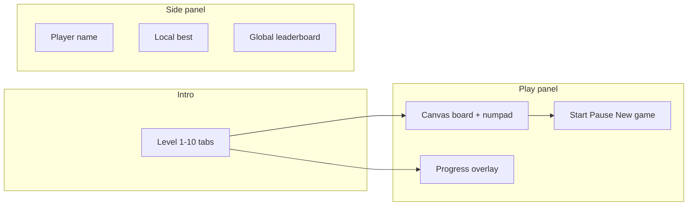
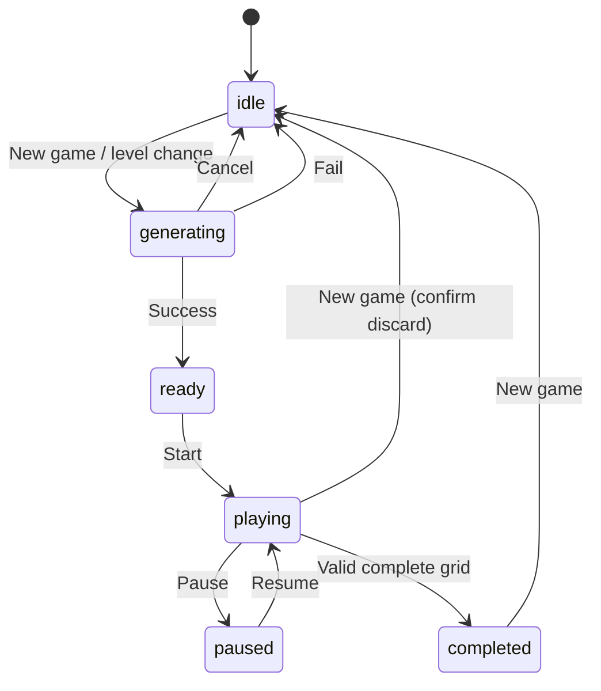

# 설계서: 수도쿠 (Sudoku)

본 문서는 `requirements.md`를 구현 가능한 수준으로 구체화한다. 먼저 요구사항 대비 **품질·리스크 이슈**와 **설계상 해결책**을 명시하고, 이어서 아키텍처·데이터·UI·API를 규정한다.

---

## 1. 품질 점검 및 해결 방안

| 이슈 | 설명 | 설계 결정(솔루션) |
| --- | --- | --- |
| **리더보드 무결성** | 클리어 시간만 보내면 클라이언트가 임의의 `time_ms`를 제출할 수 있다. 퍼즐·정답 생성이 클라이언트에 있으면 “정답 그리드” 위조도 이론상 가능하다. | **1단계(필수):** 제출 페이로드에 `puzzle`(81칸, 0–9) + `player_grid`(완성 시 81칸) + `level_id` + `time_ms` + `seed`를 포함하고, 서버에서 **스도쿠 규칙 만족 여부**와 **`player_grid === puzzle`의 고정칸 일치**를 검증한다. **2단계(권장):** 서버가 `solution`을 모르면 “완전 유효판”만으로는 다중 해 가능성이 있어, 생성기가 만든 `solution`에 대한 **HMAC 또는 서버 측 퍼즐 레지스트리**는 장기 과제로 분리한다. 단기적으로는 **합리적 상한**(예: 레벨당 최소·최대 시간 클램프), **레이트 리밋**, 동일 세션 중복 제출 방지로 스팸을 줄인다. |
| **프로그레스 신뢰도** | 백트래킹·유일해 검사는 내부 루프 길이가 들쭉날쭉해 정확한 %가 어렵다. | **단계형 가중치 모델**을 사용한다: 예) `fill_board` 0–40%, `remove_digits` 40–90%, `finalize` 90–100%. 세부 단계 내에서는 **시도 횟수/상한 대비 비율**로 근사치를 올리거나, 알고리즘이 **명시적 콜백**을 호출할 때만 바를 갱신한다. 500ms 이상 지연 시 **결정적(indeterminate) 보조 애니메이션**을 허용한다. |
| **메인 스레드 점유** | 고난이도 `countSolutions` 반복 시 UI 프리즈. | 생성 로직은 기본적으로 **Web Worker**에서 실행한다. 폴백: Worker 미지원 시에만 메인 스레드 + `requestIdleCallback`/청크 분할(알고리즘 협력 필요). |
| **경쟁 생성** | 레벨 탭을 빠르게 바꿀 때 이전 생성 결과가 늦게 도착해 잘못된 판이 표시될 수 있다. | `AbortController` 또는 **모노토닉 `generationId`** 로 “최신 요청만 적용”한다. Worker에는 `cancel` 메시지를 보낸다. |
| **모바일 입력** | 터치 기기에서 키보드 1–9가 불편하거나 없다. | Canvas **숫자 패드는 필수 UX**. 최소 터치 타깃 44px 이상 권장. |
| **접근성** | 순수 Canvas는 스크린 리더·포커스 맵이 약하다. | 보드 옆(또는 하단)에 **논리적 순서의 숨김 표 또는 `aria-live` 요약**을 둔다. 선택 셀 좌표·값·고정 여부를 **라이브 리전**으로 짧게 알린다. 포커스 가능한 **DOM 컨트롤**(일시정지, 시작)은 항상 유지한다. |
| **레벨 vs 알고리즘 난이도** | 제품 레벨(1–10)과 솔버 기법(Hard/Easy)이 1:1이 아닐 수 있다. | `levelId` → **생성 프로파일**(`attempts`, 목표 빈칸 수 범위, 허용 최대 기법 등**) 매핑 테이블**을 `lib/sudoku/level-profiles.ts` 등 한 곳에 둔다. 알고리즘 제공 후 조정한다. |
| **타이머 공정성** | 백그라운드 탭에서 시간이 흐르는 문제. | **요구사항 권장(Start 이후 측정)** 유지. 자동 백그라운드 일시정지는 **하지 않는다**(테트리스류와 동일하게 단순화). 원하면 추후 “공정 모드” 옵션으로 확장. |
| **일시정지** | 멈춘 상태에서 입력 가능하면 혼란. | 일시정지 중에는 **입력 무시**, Canvas에 오버레이. 타이머 **정지**. |
| **동순위 리더보드** | `time_ms` 동일 다수. | 정렬: `time_ms` 오름차순, 타이브레이크 **`created_at` 오름차순**(더 빨리 달성한 기록이 상위). |

위 항목은 구현 시 `todo.md`의 순서와 코드 리뷰 체크리스트에 반영한다.

---

## 2. 목표 및 범위

* **목표:** 9×9 스도쿠, 레벨 1–10, 자동 생성, Canvas UI, 키보드+마우스 입력, 클리어 시간 기록의 Supabase 글로벌 리더보드.
* **범위 밖:** 멀티플레이, 커스텀 크기, 자동 힌트(추후 확장 가능).

---

## 3. 라우트·파일·네이밍

| 구분 | 값 |
| --- | --- |
| Slug | `sudoku` |
| 라우트 | `/sudoku` |
| 페이지 | `app/sudoku/page.tsx` (메타·JSON-LD·`page-shell`·`SiteHeader`·`SudokuClient`) |
| 클라이언트 | `app/sudoku/sudoku-client.tsx` |
| API | `app/api/sudoku/scores/route.ts` (`GET` 목록, `POST` 저장) |
| 데이터 접근 | `lib/data.ts`에 `listSudokuScores`, `saveSudokuScore` (테트리스 패턴) |
| 타입 | `types/index.ts`에 `SudokuLevelId`, `SudokuScore` |
| 생성기 | `lib/sudoku/generate.ts` (또는 사용자 제공 모듈) + `lib/sudoku/worker.ts` |
| Worker 번들 | `public/workers/sudoku-generator.worker.js` 또는 Next 권장 방식에 따른 `*.worker.ts` |
| 프리뷰 이미지 | `public/images/utilities/sudoku-preview.svg` (구현 단계) |
| 기획 문서 | `mockups/utilities/sudoku/requirements.md`, 본 `design.md`, `todo.md` |

---

## 4. 정보 구조 (IA)

* `SiteHeader`
* **인트로 블록** (`sudoku-intro`): 제목, 한 줄 설명, 레벨 1–10 **탭 그리드** (테트리스 `.tetris-mode-tabs`와 동일 UX; 클래스는 `.sudoku-level-tabs`로 복제·조정)
* **메인 레이아웃** (`sudoku-layout`): 2열 — 플레이 패널 | 사이드 패널
  * **플레이 패널:** Canvas 래퍼, 상태 줄(타이머, 레벨, 일시정지 표시), 액션 버튼(Start / New game / Pause), 생성 프로그레스(필요 시)
  * **사이드 패널:** 플레이어 이름 입력, 로컬 베스트, 글로벌 리더보드, 짧은 조작 안내
* **숨김 접근성 보조:** `aria-live` 영역 + 선택 셀 설명



---

## 5. 화면 상태 머신

플레이어가 인지하는 **화면 단계(`ScreenPhase`)**:

1. **`idle`** — 레벨 선택됨, 아직 생성 전 또는 이전 판 종료. Start 가능.
2. **`generating`** — Worker에서 퍼즐 생성, 프로그레스 표시, 취소 가능.
3. **`ready`** — 생성 완료, 타이머 0, **Start** 전. 입력 잠금 또는 연습 입력만(권장: 잠금).
4. **`playing`** — 타이머 진행, 입력 허용.
5. **`paused`** — 타이머 정지, 오버레이, 입력 차단.
6. **`completed`** — 클리어, 타이머 정지, 제출 UI.



---

## 6. 도메인 모델

### 6.1 그리드 표현

* `CellDigit = 0 | 1 | 2 | ... | 9` — **0은 빈 칸**(내부·API·저장 모두 통일).
* `Grid9 = CellDigit[][]` — 길이 9×9, 인덱스 `row, col` ∈ [0,8].
* `givenMask: boolean[][]` — 초기 퍼즐에서 0이 아니었던 칸은 `true`(편집 불가).

### 6.2 세션(클라이언트)

```ts
type SudokuLevelId = 1 | 2 | 3 | 4 | 5 | 6 | 7 | 8 | 9 | 10;

type SudokuSession = {
  levelId: SudokuLevelId;
  seed: number; // u32 권장
  puzzle: Grid9;
  solution: Grid9;
  givenMask: boolean[][];
  playerGrid: Grid9; // 사용자 입력 반영
  phase: ScreenPhase;
  selected: { row: number; col: number } | null;
  startedAtMs: number | null; // performance.now() 기준 권장
  elapsedMs: number; // 누적 플레이 시간(일시정지 제외)
  generationId: number;
};
```

### 6.3 생성기 결과(Worker → 메인)

```ts
type GenerateRequest = {
  kind: "generate";
  id: number;
  levelId: SudokuLevelId;
  seed?: number;
};

type GenerateProgress = {
  kind: "progress";
  id: number;
  ratio: number; // 0..1
  label?: string;
};

type GenerateSuccess = {
  kind: "success";
  id: number;
  puzzle: Grid9;
  solution: Grid9;
  seed: number;
  metadata?: {
    givenCount: number;
    techniqueTier?: string;
    durationMs?: number;
  };
};

type GenerateError = {
  kind: "error";
  id: number;
  message: string;
};
```

---

## 7. Canvas 렌더링 설계

### 7.1 레이아웃

* 단일 Canvas를 **세 구역**으로 나눈다: **보드**, **숫자 패드**, (선택) **상태 바**.
* `ResizeObserver`로 컨테이너 너비 `W`를 읽고, `devicePixelRatio`로 `canvas.width/height`를 스케일한다.
* 보드는 정사각형 `boardSize = min(W * 0.92, maxBoard)` 등으로 계산하고, 패드는 보드 아래에 고정 높이 또는 비율.

### 7.2 그리기 순서

1. 배경(반투명 패널 톤)
2. 3×3 굵은 테두리, 셀 얇은 선
3. 고정 칸 배경(약한 대비)
4. 플레이어 숫자 / 빈 칸
5. 선택 셀 테두리(액센트 `var(--accent)`)
6. 충돌 셀 하이라이트(`var(--danger)` 15–25% 알파)
7. 완성 시 짧은 펄스(옵션, `prefers-reduced-motion` 시 생략)

### 7.3 색 토큰

Canvas `getComputedStyle(container)`로 다음 CSS 변수를 읽어 동기화한다:

| 토큰 | 변수 | 용도 |
| --- | --- | --- |
| 배경 | `--bg`, `--panel` | 캔버스 배경 |
| 텍스트 | `--text`, `--muted` | 숫자·라벨 |
| 테두리 | `--border`, `--border-strong` | 그리드 |
| 강조 | `--accent`, `--accent-strong` | 선택 |
| 경고 | `--danger` | 충돌 |
| 성공 | `--success` | 클리어 순간 |

폰트: `getComputedStyle`의 `fontFamily` 또는 `16px` 기준 `Intl` 숫자 중앙 정렬.

---

## 8. 입력 및 히트 테스트

### 8.1 포인터

* `pointerdown` 좌표를 보드/패드 사각형에 투영해 **셀 `(row,col)`** 또는 **숫자 `1–9` / clear** 결정.
* 스크롤 오동작 방지: 패널에 `touch-action: none` (래퍼 CSS).

### 8.2 키보드

| 키 | 동작 |
| --- | --- |
| `Arrow` / `WASD` | 선택 셀 이동(편집 가능 칸으로 스킵 옵션은 **끔** — 고정 칸 위에도 포커스 가능하나 입력은 무시) |
| `1`–`9` | 현재 선택 셀에 입력(고정 칸이면 무시) |
| `Backspace` / `Delete` | 빈 칸으로 |
| `Space` | (선택) 일시정지 토글 — **P**와 중복 가능 |
| `P` | 일시정지 토글 (`playing` ↔ `paused`) |

폼 포커스(`input`, `textarea`)일 때는 전역 단축키 비활성화(테트리스 `isFormTarget` 패턴 재사용).

---

## 9. 검증 정책 (확정)

* **입력:** 잘못된 숫자도 **허용 입력**(관대). 즉시 **충돌 집합**을 계산해 시각 표시.
* **충돌 정의:** 같은 행·열·박스에 동일 숫자가 2개 이상이면 해당 **모든 충돌 칸**을 하이라이트(자기 자신 포함).
* **클리어:** 모든 칸이 1–9이고 **충돌이 0**이면 완료.
* **고정 칸:** `givenMask[row][col] === true`면 `playerGrid`를 퍼즐과 항상 동기화(덮어쓰기 불가).

충돌 계산은 O(81×27) 이하의 단순 스캔으로 충분하다.

---

## 10. 타이머

* **`performance.now()`** 기반: `elapsedMs`는 `playing` 동안만 누적(`requestAnimationFrame` 또는 250ms 틱).
* **표시:** `mm:ss.cs` (테트리스 `formatTime`과 유사).
* **Start** 이후 첫 틱부터 누적.

---

## 11. Supabase · API

### 11.1 테이블 `sudoku_scores` (제안)

| 컬럼 | 타입 | 설명 |
| --- | --- | --- |
| `id` | uuid | PK |
| `player_name` | text | 표시명 |
| `level_id` | int | 1–10 |
| `time_ms` | int | 클리어 시간 |
| `seed` | bigint | 재현용 |
| `puzzle` | text | 81자 문자열(`0`–`9`) 또는 JSON |
| `created_at` | timestamptz | 기본 now() |

인덱스: `(level_id, time_ms asc, created_at asc)` for leaderboard.

### 11.2 `GET /api/sudoku/scores?level=3`

* `level` 쿼리: 1–10.
* 응답: `{ scores: SudokuScore[] }` 상한 50건.

### 11.3 `POST /api/sudoku/scores`

* 바디 예시:

```json
{
  "playerName": "DOPT",
  "levelId": 3,
  "timeMs": 125430,
  "seed": 123456789,
  "puzzle": "000...",
  "playerGrid": "123...",
  "givenMask": "101..."
}
```

* **서버 검증 순서:**
  1. `levelId`, `timeMs`, 문자열 길이 81, 문자 집합 `0-9`.
  2. `givenMask`와 `puzzle`의 고정칸이 `playerGrid`와 일치.
  3. `playerGrid`가 완전하고 스도쿠 규칙 만족.
  4. (선택) `timeMs`가 레벨별 상한/하한 내.

검증 실패 시 `400` + 메시지. Supabase 미설정 시 테트리스처럼 `{ saved: false }` 폴백 가능.

### 11.4 타입 `SudokuScore`

```ts
export type SudokuScore = {
  id: string;
  player_name: string;
  level_id: number;
  time_ms: number;
  seed: number;
  created_at?: string;
};
```

---

## 12. 로컬 저장

* `localStorage` 키: `dopt-sudoku-player-name` (기본값 `"DOPT"`).
* 로컬 베스트: `dopt-sudoku-best-v1` → `Record<SudokuLevelId, { timeMs: number; createdAt: string }>` (더 짧은 시간만 갱신).

---

## 13. 에러·엣지 케이스

* **생성 실패:** 토스트 또는 인라인 에러 + 레벨 선택으로 복귀. “다시 시도” 버튼.
* **네트워크:** 리더보드 로드 실패 시 빈 목록 + 비차단 메시지.
* **제출 실패:** 클리어 상태 유지, 재시도 버튼.
* **Reduced motion:** 셀 애니메이션·완성 펄스 생략.

---

## 14. SEO (페이지)

* `metadata`: 제목 `Sudoku`, 설명 한글 1–2문장.
* `canonical`: `/sudoku`.
* OG/Twitter: `/images/utilities/sudoku-preview.svg`.
* JSON-LD: `WebSite` + `SoftwareApplication` (기능: 레벨, 리더보드, Canvas).

---

## 15. 테스트 체크리스트 (수동)

* [ ] 레벨 전환 시 이전 Worker 결과 무시
* [ ] 생성 취소 후 UI 일관성
* [ ] 고정 칸 입력 불가·시각 구분
* [ ] 충돌 하이라이트 정확성
* [ ] 클리어 시에만 POST
* [ ] 리더보드 정렬·동순위
* [ ] 모바일 패드-only 플로우
* [ ] 라이트/다크(향후 테마 확장 시) 색 대비

---

## 16. 구현 시 의존성

* 알고리즘 모듈은 §6.3 메시지 형식을 지키면 UI와 독립적으로 통합 가능하다.
* `globals.css`에 `.sudoku-*` 블록을 추가할 때 **테트리스 블록을 복사·축소**하여 이질감을 없앤다.

---

본 설계서는 `requirements.md`의 미결 영역(검증 정책, 무결성, 프로그레스, Worker, API 스키마)을 **결정**으로 닫는다. 구현 세부는 `todo.md`의 작업 순서를 따른다.
